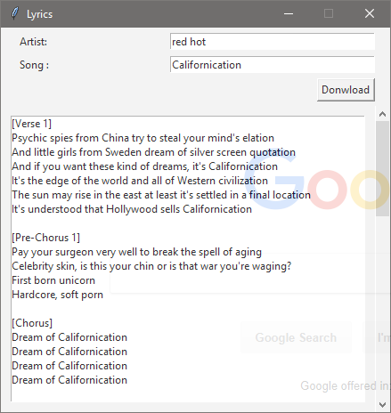
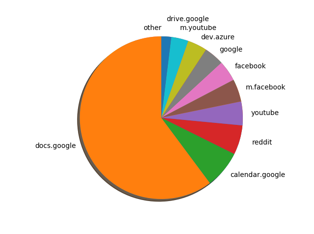
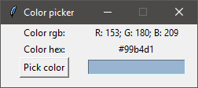
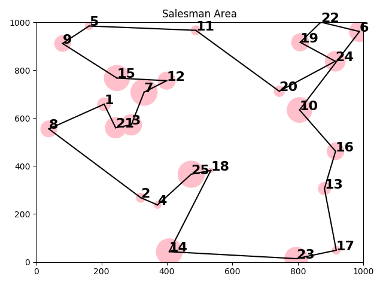
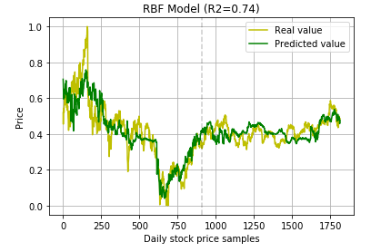

# Small Python projects

## Apps:

- **lyrics** - transparent, topmost app that shows lyrics of a given song
  

- **face-detector** - using pre trained ML model to detect face in webcam
  

- **flashcard converter** - converts files or given words into flashcard friendly format
    ```
    perro               Spanish     English
    dog                 perro       dog
    gato        =>      ratón       mouse
    cat                 gato        cat
    ratón
    mouse
    ```

- **browser-history-analyzer** - app showing pie chart with data from your Chrome history :)
  

- **color-picker** - let you pick color (rgb and #) from any window (workis similar to tool from Paint or MAC)
  

- code-lines-counter - counting lines in files with specified extensions
  

- github-backup - downloads all repos of a given github user (might be usefull near the end of the GitHub, Internet, World etc.)

- json-formatter - very simple CLI for formatting JSON files (+ lets you specify indent)
  

- led-simulator - just converts decimal numbers to HEX and BIN values (name comes from project where instead of bin values there were LEDs)

- rest-api-spammer - simple CLI for sending multiple GET/POST/DELETEs to REST API at once (usefull for testing and early stage development)

## Machine learning

- [Great summary of ML methods](https://vas3k.com/blog/machine_learning/?fbclid=IwAR1zmngzuf7RHFrKLGfv7rIeVSNdAOrtOmQgrgYCFN57Om-CPQoqTyQ4BdY) - e.g. quote about NNs: `We have a thousand-layer network, dozens of video cards, but still no idea where to use it. Let's generate cat pics!"`

- keras-model-export - example of exporting keras model to Tensorflow format

- **salesman** - genetic algorithm solution for [Travelling salesman problem](https://en.wikipedia.org/wiki/Travelling_salesman_problem)

  

- speech-recognition - recognizing 12 different speach commands in polish

- stock-prices - predicting stock prices with SVMs with 3 different kernels (linear, polynomial and RBF)

## Web:

- django-rest-api - basic implementation of REST API in Django

- simplest-http-server - http server in 2 lines of python code
